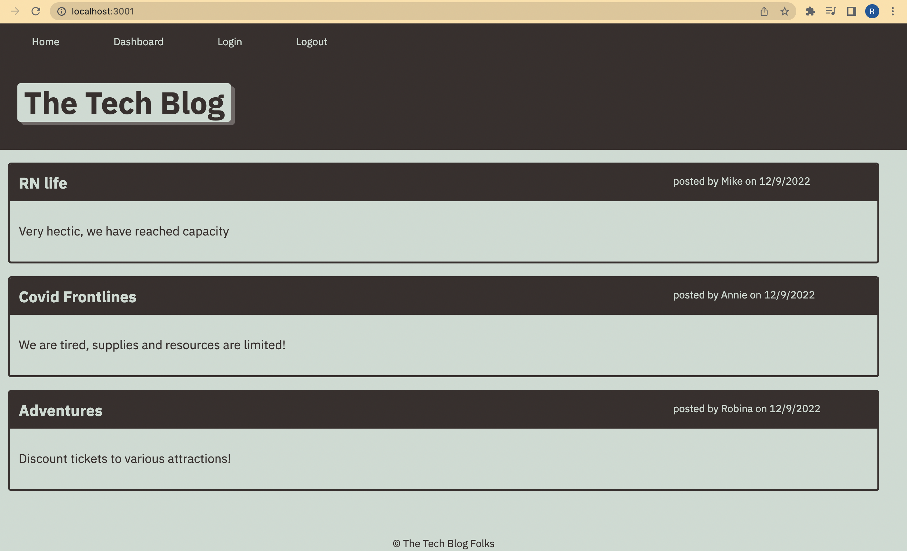

# tech-blog
## Description 
A website where developers can share posts and comment on blogs from other developers. The app makes marvelous use of the MVC paradigm and handlebars js template engine. 

## Technologies

   *  "bcrypt": "^5.0.0",
   * "connect-session-sequelize": "^7.0.4",
   * "dotenv": "^8.2.0",
   * "express": "^4.17.1",
   * "express-handlebars": "^5.2.0",
   * "express-session": "^1.17.1",
   * "mysql2": "^2.2.5",
   * "sequelize": "^6.3.5"  

   ## Links 

   ## Contributions
   * Contributions are always welcome! Utilize the repository link above and clone my repo. 

   ## Questions 
   All queries about my repo can be addressed via email at <a href="mailto:rgonsahn@yahoo.com">mail link</a>
 or follow more of my work on github at <a href="https://github.com/rgonsahn?tab=repositories">Github</a>. 

 ## Screenshot 
 
